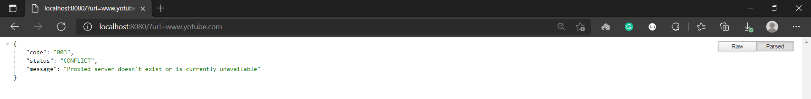

# Proxy Server
Simple proxy server that logs headers of all HTTP requests it forwards. It has been developed in Java using Spring Framework and includes unit testing with JUnit 5 and Mockito.

## Technologies used

## How does it work
* The proxy server **receives** the desired URL server through a **query parameter** called **url**
* It **checks if** the received **URL is valid** (protocol is optional)
* It **performs a request** to the proxied server and if the server response **status code is 200**, it **logs the headers**
* It **redirects** to the proxied server with a redirection status code

## How to use it

### Running the application

* #### Option 1 (IDE)
Clone the repository to your local machine. Open the project in an IDE that supports Java projects and make sure you have JDK 11. Run the application.
* #### Option 2 (JAR)
Clone the repository to your local machine. Open your command-line interface, navigate to "**~out\jar**" folder and run "**java -jar proxy-server.jar**"

### Using the application
* Choose any website to visit, e.g.
> https://www.youtube.com
* Go to your browser and type **localhost:8080?url=<website_you_want_to_visit>**, e.g.
> localhost:8080?url=https://www.youtube.com

* You will be redirected to the website you chose
 

* If you chose the first option, you will see headers' information in your IDE console. 
If you chose the second option, you will see it in the command-line interface.

#### Special considerations
* Remember **https://www.youtube.com**, **http://www.youtube.com**, **www.youtube.com** and **[youtube.com](https://www.youtube.com)** are equally valid and will redirect you to the same website.
* Browsers may save the server response redirection in cache, so you might see logs are not printing if you point to the same URL

### Exceptions
If the request cannot be proxied to the requested URL, one of the following exceptions will appear on your browser:

| HTTP Status | Code     | Exception                            | Description
|-------------|----------|--------------------------------------|--------------------------
| 400         | 001 | MissingURLException      	    | URL is missing on the request
| 400         | 002 | InvalidURLException      	    | Given URL couldn't be parsed to a valid URL
| 409         | 003 | ProxiedServerErrorException    	    | Proxied server doesn't exist or is currently unavailable

